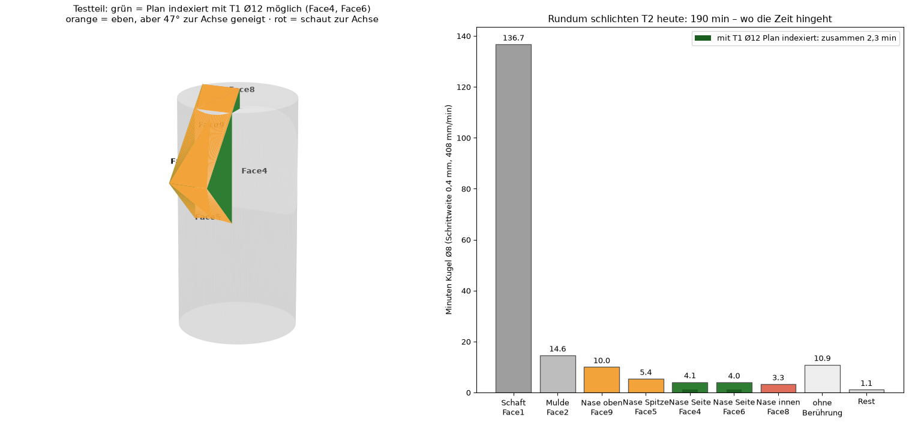
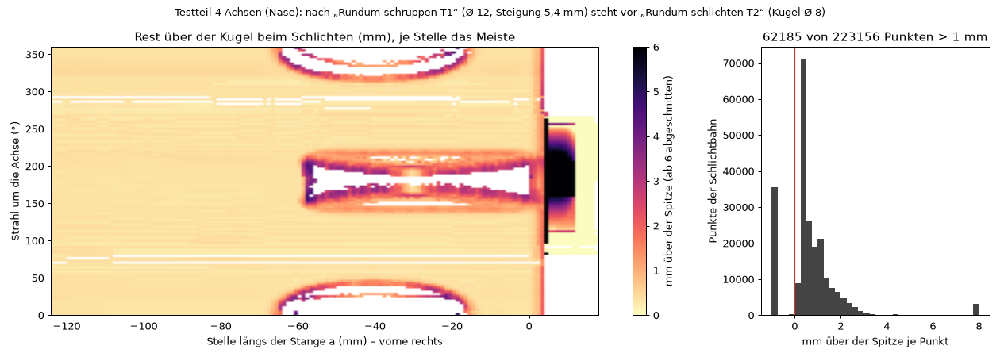

# Offene Fragen an Manuel

Hier steht jede Frage, die **nur Manuel** beantworten kann – mit dem Grund, warum Claude sie
nicht selbst beantwortet, und dem, was die Antwort ändert. Beantwortet: Eintrag raus, die Antwort
kommt in den Verlauf (`archiv/DEV_PROMPT_HISTORY.md`) oder in die Spezifikation. Nichts davon wird
durch Prüfläufe ersetzt: Was Manuel entscheiden muss, wird hier gefragt, nicht nachgemessen
(Arbeitsregeln, Abschnitt 0; Manuel, 2026-10-10).

Je Frage: **die Frage** – *Warum nur Manuel* – *Was die Antwort ändert* – seit wann.

(Die Fragen 1–3 hat Manuel in P-2026-10-10-08 beantwortet, Frage 4 in P-2026-10-10-36 – siehe
Verlauf.)

Alle folgenden Fragen kommen von Manuels zweitem 4-Achs-Testteil
(`beispiele/testteil_4achs_nase.FCStd`, CLX550, Nacht vom 10. auf den 11.10.2026). Was in der
Nacht ohne ihn ging, ist gebaut (P-2026-10-10-56 bis -60: Luft im Freivorschub, alles schneller,
richtige Rest-Meldung); das hier ändert, *wie* geschnitten wird – das entscheidet er.

### 5. Ebene Flächen mit dem Schaftfräser fertig – und wie viel bringt das wirklich?

Manuel (10.10.): „was der Schaftfräser fertig schlichten kann … sollte vll der Schaftfräser
machen … vll als Option ‚gerade Flächen mit dem Schaftfräser fertig schlichten‘“. Gemessen, wo die
190 min von „Rundum schlichten T2“ (Kugel Ø 8, Schrittweite 0,4, 408 mm/min) hingehen:

| Fläche | Kugel heute | mit dem Schaftfräser |
| --- | --- | --- |
| Schaft Ø 60 (Face1) | 136,7 min | – (rund, Kugel bleibt) |
| Mulde (Face2) | 14,6 min | – |
| Nase, Seiten Face4 + Face6 | 8,1 min | **2,3 min** mit „Plan indexiert“, T1 Ø 12, Zeilen 7,2 mm |
| Nase oben/Spitze Face9 + Face5 (47° zur Achse) | 15,4 min | geht nur mit der Flanke (neu zu bauen) |
| Nase innen Face8 (schaut zur Achse) | 3,3 min | geht nicht von außen |

**Die Frage:** Soll der 4-Achs-Assistent ebene Flächen, die „Plan indexiert“ kann, mit dem
Schruppfräser fertig machen und die Kugel dort nicht mehr fahren lassen – als Haken, angehakt
oder nicht? Und ist die Nase dafür überhaupt das Richtige: 6 von 190 min.
*Warum nur Manuel:* Es ändert die Strategie ohne Vorgabe (Arbeitsregeln, Strategiewahl). Und:
Die Kugel muss trotzdem über die Nase (ihre Spirale geht rundum); sie darf über den fertigen
Flächen nur schnell fahren, wenn das Modell des Rests Wände kennt – es kennt nur einen Radius je
Strahl. Dafür müsste die Kugel dort ausgelassen werden (Zeilen statt Spirale über den Rest) – das
sieht anders aus.
*Was die Antwort ändert:* Ja → Haken „Ebene Flächen mit dem Schaftfräser“ im Schritt 2, die Kugel
fährt nur die übrigen Flächen. Nein → bleibt, wie es ist.
Seit 2026-10-10.

### 6. Der Schaft kostet 137 von 190 Minuten – Schrittweite oder Lage in der Stange?

Die Kugel Ø 8 fährt den Ø 60 mit 0,4 mm Schrittweite – Kammhöhe 0,005 mm. Mit 0,8 mm wären es
0,02 mm und rund die halbe Zeit; die Schrittweite kommt aus dem Einsatz „Schlichten“ von T2 in der
Werkzeugverwaltung. Und: Mit „ganzes Teil möglichst mittig“ liegt der Schaft 13,8 mm neben der
Achse (Stange Ø 90) – rund wäre er mit „Mitte der Fläche“ (Stange Ø 118,5).
**Die Frage:** Ist 0,005 mm Kammhöhe gewollt? Und soll der Assistent bei einem runden Hauptkörper
auf die Zeit hinweisen, die „ganzes Teil mittig“ kostet?
*Warum nur Manuel:* Schnittwerte und Rohteil sind seine Entscheidung.
*Was die Antwort ändert:* die Schrittweite in seiner Werkzeugverwaltung, oder ein Hinweis im
Schritt 1 des Assistenten.
Seit 2026-10-10.

### 7. Der Halter stößt ans Teil – soll die Bahn ihm ausweichen?

„Kollision prüfen“ am Testteil mit seinen Werkzeugen aus RC1 (Halter „VDI40 angetrieben radial ·
ER32“, Kopf Ø 80) meldet drei Berührungen, alle mit dem Halter: beim Schruppen T1 vor der
Wellenstirn (Satz 8583, die Spitze bei X −2,3 hinter der Achse, Z 18,6), beim ersten Eintauchen
des Schlichtens T2 (Satz 7, Z 17,1) und der Halter von T1 im Revolver, während T2 mit Y −48,7
schlichtet (Satz 39363). Die Rundum-Bahnen kennen den Halter nur für den Abstand zum Futter.
**Die Frage:** Soll „Rundum schruppen/schlichten“ den Halter (und die Nachbarplätze im Revolver)
gegen das Teil rechnen – dort, wo er anstößt, nicht so tief oder nicht so weit quer fahren und
den Rest stehen lassen (mit Meldung)? Oder reicht die Meldung im Prüffenster?
*Warum nur Manuel:* Es lässt Material stehen oder ändert die Bahn; ob ein längeres Werkzeug, ein
anderer Halter oder ein anderer Platz die bessere Lösung ist, weiß nur er.
*Was die Antwort ändert:* ein neuer Schritt in der Bahn (Halter gegen Teil) – oder nichts.
Seit 2026-10-10.

### 8. Vor dem Schlichten stehen an Kanten bis 5 mm – Zwischenschritt oder kleinere Steigung?

Nachts gemessen (11.10.), wie viel nach „Rundum schruppen T1“ (Ø 12, Steigung 5,4 mm, mit
Querachse) über der Kugel von „Rundum schlichten T2“ (Ø 8, 0,4 mm) steht: auf dem Schaft meist
das Aufmaß (0,3–0,6 mm), aber rund um die Mulden 2–4 mm (die Stufen der Spirale mit 5,4 mm
Steigung an schrägen Wänden) und vorne an der Nase 6 bis 25 mm. 62 000 der 223 000 Punkte
schneiden mehr als 1 mm. Vorne ist ein Teil davon eine Schwäche des Restmodells (ein Radius je
Strahl; was das Schruppen von der Gegenseite an der Achse wegnahm, kennt es nicht) – sicher ist
es dort nicht nachzuweisen. Die Operation meldet es heute nur im Report-Fenster („vb.rest_viel“).
**Die Frage:** Soll bei viel Rest ein Zwischenschritt kommen (die Kugel erst mit größerer
Schrittweite vorschlichten, oder nur dort, wo mehr als z. B. 1 mm steht), oder soll das Schruppen
an schrägen Wänden enger steigen? Oder reicht dir die Kugel so (Ø 8, bis 5 mm tief an Kanten)?
*Warum nur Manuel:* Ein neuer Schritt oder andere Schruppwerte ändern, wie geschnitten wird
(Strategiewahl); ob die Kugel das aushält, weiß er von seiner Maschine.
*Was die Antwort ändert:* ein Schritt „Vorschlichten“ im 4-Achs-Assistenten (angehakt, wenn mehr
als … steht) – oder eine Meldung im Assistenten statt nur im Report-Fenster – oder nichts.
Seit 2026-10-11.

