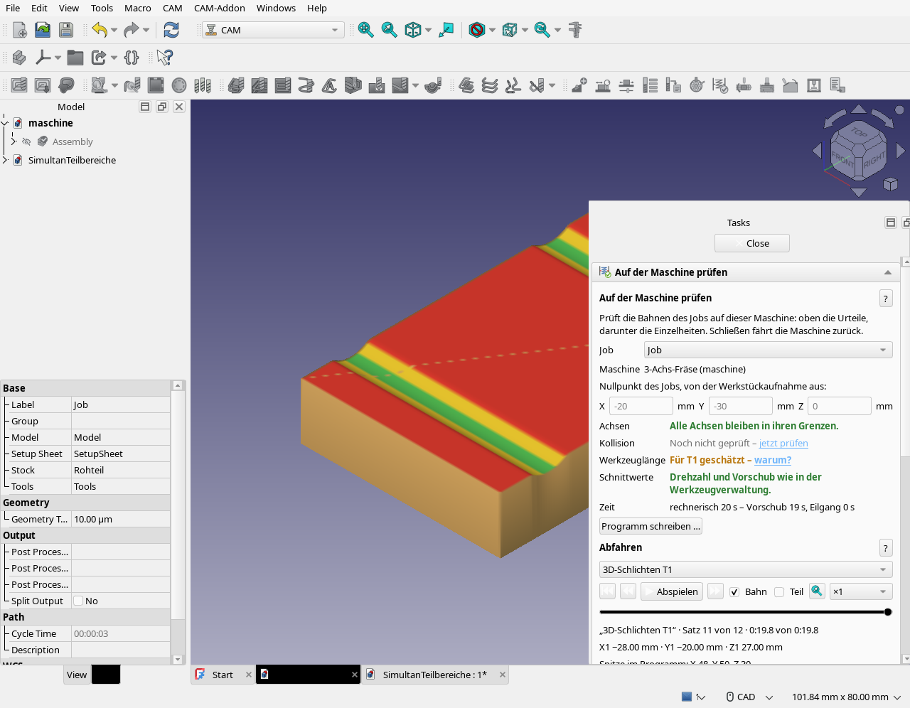

# Zwischenstand am 09.10.2026, nach 10 Uhr

**Gesichert, keine vollständige Abnahme.** Manuel verlangt den aktuellen Stand
aufgeschrieben und gepusht. Dieser Zwischenstand liegt auf einem eigenen Branch;
`main` bleibt bis zur vollständigen Qualifikation auf 0.203.1.

Produktstand **0.204.0**, installierte Prüfumgebung **FreeCAD 1.1.4R45040**.
Der Wochen-Build und andere Betriebssysteme wurden in diesem Lauf nicht geprüft.
Der Termin 10 Uhr ist erreicht; die erforderliche Gesamtqualifikation ist noch offen.
Qualität hat nach Manuels Auftrag Vorrang.

## Bestanden

- Alle 106 nativen Dateien erfasst: **105 bestanden**, eine ausdrücklich nicht
  verfügbar (`test_export.py`: native CAM-Maschinendefinition fehlt in dieser Version).
- 2,5D, 3D, Rundum, 3+2 und Simultan einschließlich D12-Prüfstand, bestehender
  Bestmarken, realer gelesener Maschinengrenzen, Materialrest und NC-Ausgabe.
- Goldene Gesamtfolge unverändert: **46,47016348782406 s Bearbeitungszeit**,
  5948 Punkte, 6181 NC-Bewegungen, SHA-256
  `83a7f0968c79a088a898befb0c6425db21c7808f0bf112742529e8b92cb489a5`.
  Rechenzeit 243,88 s; Python-Spitze 240,44 MiB.
- Vollständige Freiformplanung zuletzt: 1116,07 s Vergleichsrechnung,
  401,21 MiB Python-Spitze; unveränderte Bahn-/NC-/Zeitreferenz und feste
  Speichergrenze 802,43 MiB bestanden. Einschließlich feiner Materialprüfung
  bei 0,05 mm, Übernahme und Rücknahme: gesamter Prozess 1314,70 s,
  maximale Prozess-RSS 5111,86 MiB. Python-Messung und Prozess-RSS sind
  unterschiedliche Messgrößen.
- Neue sichere innere Teilstrecken: sechs gelesene Beispielkinematiken,
  Standard-D12/Schaft und Kugel, tatsächliche NC/BRep-Verbindungen,
  Material-/Last-/Eilganggegenproben. Lange Probe 4004 Quellpunkte/4040 NC,
  12,20 s, 36,45 MiB Python-Spitze.
- Keine bestehenden goldenen Referenzen neu geschrieben und keine Anschläge erweitert.
  Persönliche Werkzeugbibliothek unverändert: SHA-256
  `a6a48e751b8dc7b6c4c298aff9e5ae54482725be89c438a41cc2ad8a0033332c`.

## Noch offen

Der sichtbare V4b-Lauf läuft weiter: Momentaufnahme **61/126 Szenarien**,
**52 bestanden**, **9 Befunde**.
Das ist keine Gesamtfreigabe. Die Liste steht in
[ergebnisse-zwischenstand.tsv](ergebnisse-zwischenstand.tsv), Einzelbefunde in
[gui-befunde.json](gui-befunde.json).

- Abfahren: alte Erwartung fiktiver Stationen außerhalb Anschlägen und alter
  Operationseinstieg vor dem bereits eingebauten Werkzeugwechsel; strenger
  Gegenprobenentwurf vorbereitet, noch nicht angewandt.
- **B-016 reproduziert:** ein Undo lässt `Clone002` zurück. Öffentlicher Observer
  zeigt: nativer Standardwerkzeugimport schließt die Transaktion, Stock/Klon
  entstehen danach unprotokolliert. Kandidat ohne unbenutzten Standardimport
  vorbereitet; Undo/Redo und Wiederöffnen müssen ihn erst qualifizieren.
- Zwei Simultan-GUI-Szenarien halten ein gelöschtes QScreen-Objekt über Wartephasen;
  tatsächliche Fenster sind auf DP-1, die Testplatzierung muss QScreen frisch lesen.
  Dies betrifft Prüfszenarien, kein belegter Bahnfehler.
- Simultanplanung erreicht das äußere 180-s-Limit; das Szenario selbst sieht bis
  zu 600 s Wartezeit vor. Noch diagnostizieren und die Läuferzeit konsistent
  behandeln; keinen bestandenen GUI-Vergleich behaupten.
- Maschine/Bearbeitung ebenfalls äußeres Zeitlimit erreicht; Ursache offen.
- Weitere Szenarien laufen noch. Reale Starter-Ladepfade, eigenes Profil und DP-1
  nach dem Gesamtlauf abschließend prüfen.

## Fortsetzen

1. Laufende Runde zu Ende laufen lassen, keine zweite FreeCAD-Prüfung parallel starten.
2. Neue echte Befunde behandeln, vorbereitete Entwürfe gezielt qualifizieren.
3. Undo-Fix samt vollständigem Objektbestand/Redo/Restore prüfen und separat committen.
4. Betroffene GUI-Szenarien mit frischen Profilen wiederholen, Referenzen erhalten.
5. Drei reale Starter prüfen, finalen Bericht schreiben; erst dann Update auf `main`.

Der lokale Runner/alle Rohbelege liegen unter
`/home/manuel/freecad_cam/ergebnisse/abgabe-2026-10-09/`; aktuelle Ausgabe
`gesamtstand-v4b/`, Log `gesamtlauf-v4b.log`. `GESAMTLAUF-LESEN.md` erklärt
Profil-, Hash-, Speicher- und Bildschirmnachweis sowie die strengere Undo-Gegenprobe.
Der Runner nutzt 16 GiB ohne Swap, Originaltests unter `__main__` und je Test ein
vorher angelegtes, vor Schreibzugriffen überprüftes Profil.

Die lokalen Starter unter `/home/manuel/freecad_cam/testen/0.204.0/` verwenden
`/usr/bin/freecad`, einen eigenen Snapshot und eigene Profile auf DP-1.
`Addon-starten.sh` öffnet eigene Teile/Maschinen ohne vorgegebene Beispielmaschine;
`Teilbereiche-starten.sh` und `Freiform-starten.sh` bieten zwei Beispiele.
Die derzeitige Snapshot-Kopie steht noch auf Commit `2f937bb`; Produktcode ist
zum geprüften Stand bytegleich, neuere Testkorrekturen erst nach dem Abschluss kopieren.

Die allgemeinen Bahnen richten sich nach der ausgewählten Maschine; G550 ist
nur eine zusätzliche Beispielzuordnung. Keine vollständige Matrix aller denkbaren
Maschinen/Werkzeuge/Teile und keine globale Optimalität beliebiger Teile behauptet.
Neue Einfahrten mitten im Material, weitere Schneidenformen und automatische
Aufspannungswahl bleiben eigenständige offene Funktionsschritte.

